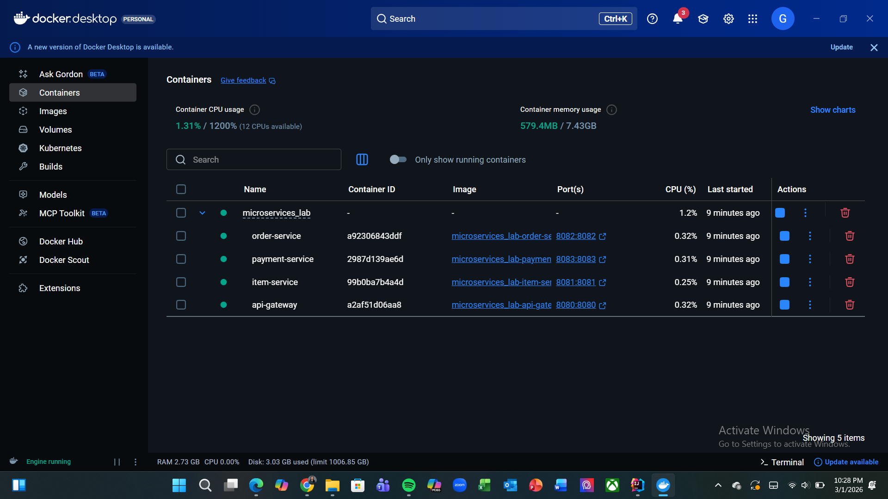
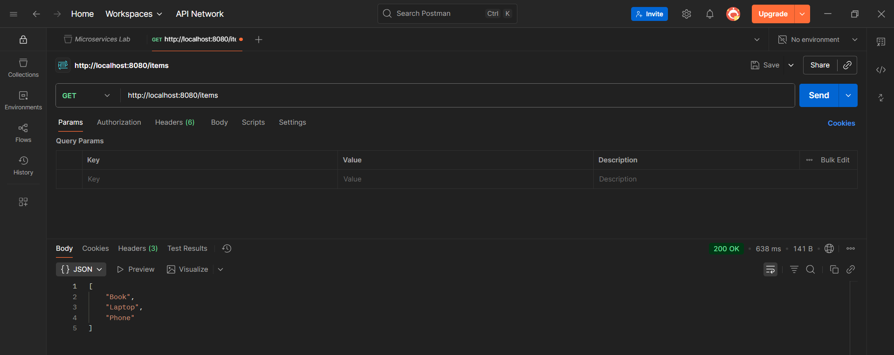
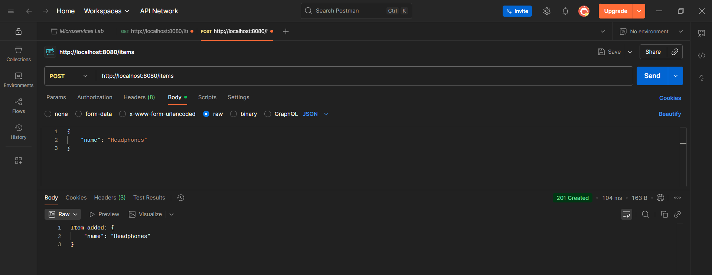
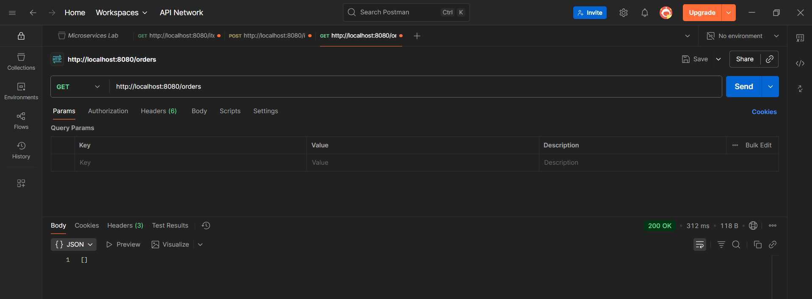
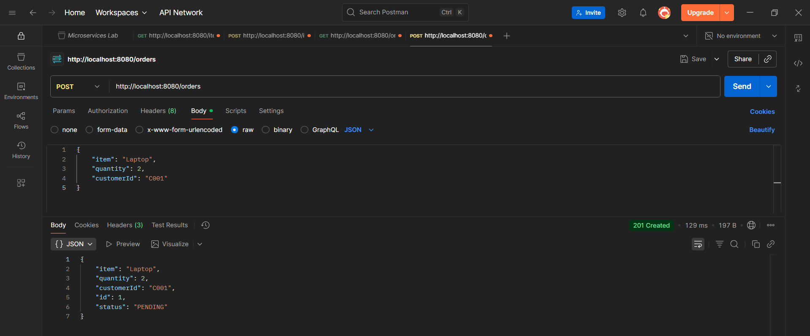
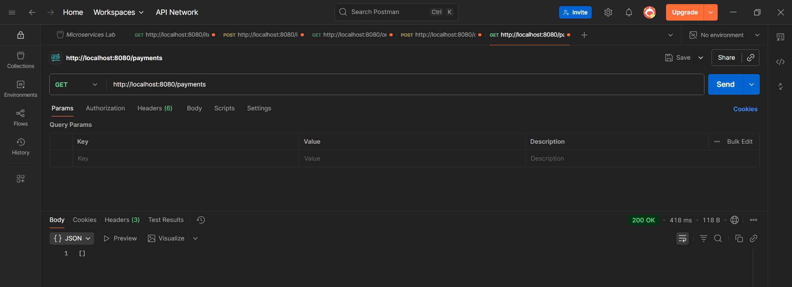
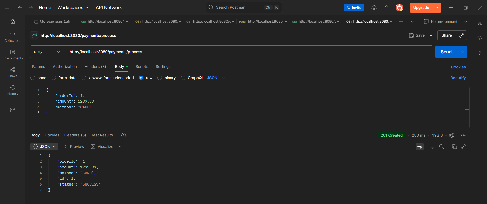

# Microservices System - API Testing Evidence

## System Status
* **Docker Setup**: All containers (Gateway, Item, Order, and Payment services) are running successfully.

---

## API Gateway Testing (Port 8080)
The following evidence confirms that the API Gateway is correctly routing requests to the individual microservices.

#### 🛒 Item Service
* **GET /items**: Retrieves the current item list.
  

* **POST /items**: Adds a new item to the inventory.
  

### 📦 Order Service
* **GET /orders**: Retrieves the list of active orders.
  

* **POST /orders**: Creates a new order entry through the gateway.
  

### 💳 Payment Service
* **GET /payments**: Retrieves the history of processed payments.
  

* **POST /payments**: Processes a new transaction via the gateway.
  